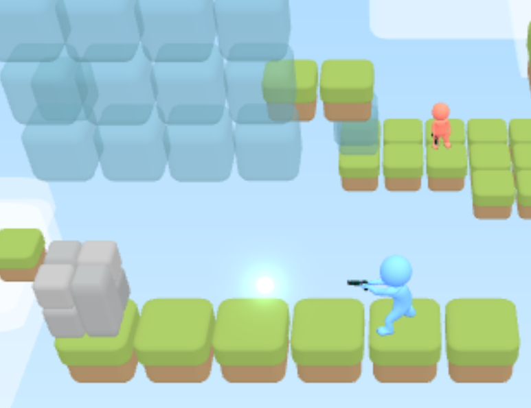
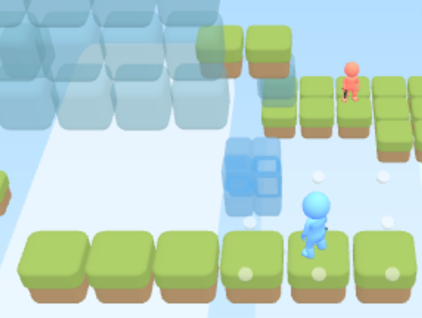

  
   
  <i>Image 1, the main menu</i>

  
   
  <i>Image 2, shooting a block to pick it up</i>

  
   
  <i>Image 3, placing a block on the upper-left corner (cursor not visible)</i>

# Introduction
This is the repository for the online browser-based game "Bloxu". Bloxu is a two-player co-op puzzle game where the purpose is to complete puzzle levels using block manipulation mechanics. Currently the game has 7 levels, which utilize the fundamentals of the game (picking up blocks, placing them and undo/redo). In the future, new block types and tools with more complicated interactions should be added to enable progressively advancing puzzles that maintain the player's interest.

## How to Play the Game
You can play the game at: https://joonashalinen.net/bloxu. The game is intended to be played online with a friend but it can also be played in single player mode, where you will have to control both characters.

### Hosting a New Game
To start playing, you must either host a new game or join an existing one. If you wish to host a new game, you can press the "Host Game" button on the title menu. After you have hosted a new game, you will receive a game code, which you can tell your friend so they can join the same game with you. After your friend has joined, the game will begin.

### Joining a Game
To join a game, you need the host of the game to tell you their game code. Once you know the game code, you can join a game by pressing the "Join Game" button on the title menu. Doing so will prompt you to enter your game code. Once you have entered a valid game code, the game will begin.

### Controls
The game teaches the controls as you need them but the table below also lists the controls of the game.

| Button  | Description |
| ------------- | ------------- |
| W / A / S / D  | Move forward / left / backwards / right  |
| Space  | Jump |
| Left mouse button  | Shoot / place block |
| Q  | Undo previous block placement  |
| E  | Redo previous block placement  |
| Z  | Switch between characters (if in single player) |
| R  | Leave entered portal |

# Central Third Party Libraries
The project uses some third-party libraries. The most central of them is BabylonJS, which is the game engine the project uses. In addition, ExpressJS as well as WebSockets via the 'ws' library are used in the online server. Finally, webpack is used to bundle the final source code that is run on the browser.

# Project Folder Structure
The following is a list of the most important files and folders as well as their descriptions:

* src/: Contains all the source code of the project.

* src/components/: Contains all reusable classes of the project. The classes are categorized into subfolders based on the subject area of the classes. Each subfolder is thought of as a reusable class library fit for some specific problem domain. To facilitate modularity, circular dependencies between libraries is not allowed. Each library subfolder contains two subfolders: 'prv' and 'pub'. The former contains all classes that are deemed private for that library and the latter those that are public (i.e. for use outside the library).

* src/services/: Contains the code for each service of the project (see 'Service Architecture' below).

* src/browser/: Contains files and folders only relevant for the browser-side instance of the game (as opposed to the online server that facilitates online play).

* src/browser/app.ts: The main program that runs the browser-side instance of the game.

* src/server/: Contains the files and folders only relevant for the online server of the game. The online server runs perpetually on the cloud and facilitates online play.

* src/server/dist/index.ts: The main program that runs the online server.

# Service Architecture

The project has a conceptual service architecture. The following diagram shows each service as well as their relationships to another.

  
   
  <i>Image 4, service architecture</i>

A solid arrow from a service to another in the diagram denotes a "knows of" relationship. If a service knows of another service, then it most likely has a dependency relationship to it. Knowing about another service means that the service is expected to a) exist and b) send or receive the expected messages. To promote modularity, circular dependencies between services are not allowed.

A dashed arrow indicates an implementation inheritance relationship. The target of the arrow is then not a concrete service but an interface. The source of the arrow then implements that interface.

As discussed above, each service is able to send messages to other services. In addition, they can send public messages that are not sent to any specific service. Instead, all services receive these types of messages and can choose for themselves if they wish to care about the received message or not.

## Individual Service Responsibilities

The following is a description of the individual responsibilities of each service:
* **3D World:** This service is responsible for running the game engine. It provides access points for the other services so that they can interact with the objects in the world.

* **IO:** The IO service is responsible for capturing user controls, such as keyboard and mouse events for example. The IO service sends public messages when the user controls change. The IO service adds a layer of abstraction that can make it possible to decouple the game from the user controls. This can be useful in the future if support for different types of controllers is added, such as for joystick controllers for example.

* **Creature:** The Creature service provides the glue between the local player character's objects in the 3D world and the real user controlling the player. Most importantly, it is responsible for connecting user controls to the player character in the 3D world.

* **Remote Creature:** A Remote Creature service is instantiated for the other player in online co-op. Remote Creature connects the real human playing as the other player to the corresponding player character in the 3D world.

* **Creature Coordinator:** This service provides general features where interactions between Creatures must be managed. Currently it implements the logic behind switching between the two player characters in single player.

* **Online Synchronizer:** This service is responsible for ensuring that the two remote separate game instances stay synchronized (i.e. that they 'agree' about the state of the world).

* **Game Master:** The Game Master service controls all universal game logic. 'Game logic' means any behaviour that is exclusively part of the idea of a co-op puzzle game such as Bloxu. For example, collision physics is not game logic because it is behaviour that applies to many kinds of 3D simulations instead of just the Bloxu game. Conversely, deciding that the next level should begin because both players have reached the end portal is part of game logic.

* **UI:** The UI service is responsible for managing all GUI behaviour.

## Service Folder Locations

The locations of each service in the project folder structure are as follows:
| Service  | Folder Path |
| ------------- | ------------- |
| 3D World  | src/services/world3d |
| IO  | src/services/io |
| Creature / Remote Creature  | src/services/creature/pub |
| Creature Coordinator  | src/services/creature_coordinator/pub |
| Online Synchronizer  | src/services/online_synchronizer |
| Game Master  | src/services/game_master |
| UI  | src/services/ui |

# Concrete Process Architecture

The previous description of the project's service architecture was a description of the conceptual service architecture. Conversely, this section describes what the real-world processes are and which services they run. In the context of the browser client, a process is a web worker. In the context of the online server, a process is an operating system process. The following image depicts the individual processes and their relationships to one another.

  
   
  <i>Image 5, process architecture</i>

As in the diagram of the service architecture, a solid arrow indicates a "knows of" relationship. Similarly, a dashed arrow indicates an implementation inheritance relationship. The difference between this diagram and the conceptual service architecture diagram is that some services are joined into the same process. Additionally, the "Online Synchronizer" service is split into two separate processes: one running on the browser and one running on the online server.
