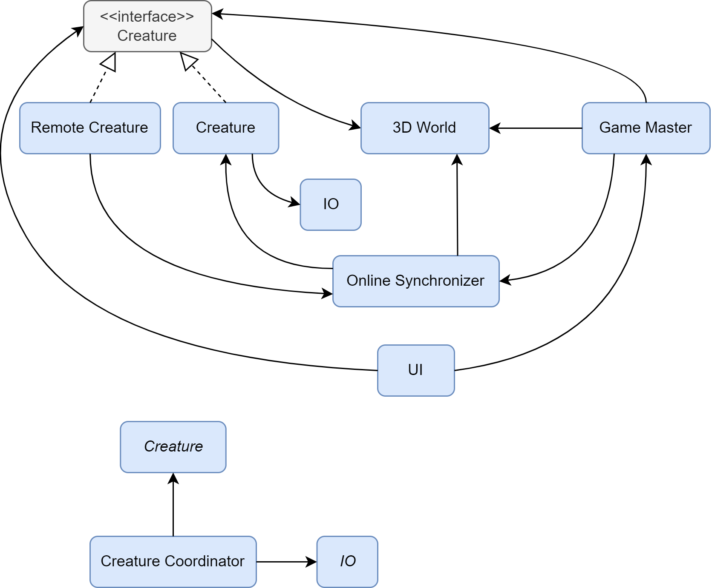

# Introduction
This is the repository for the browser-based online game "Sky Duel". The in-development name of the project is 'Bloxu' which is why the repository is named correspondingly. This readme file serves as the main documentation of the game, its project structure and its architecture.

## How to play the game
You can play the game at: http://138.197.9.66:3001/. The game is a two-player shooting game where the goal is to defeat your opponent. You can defeat your opponent by either making them fall from the map or by shooting them.

Additionally, you can also build by placing blocks in the world. These blocks can serve as platforms for you to walk on. Alternatively, you can use these blocks to shield yourself from your opponent's bullets.

### Hosting a new game
To start playing, you must either host a new game or join an existing one. If you wish to host a new game, you can press the "Host Game" button on the title menu. After you have hosted a new game, you will receive a game code, which you can tell your friend so they can join the same game with you. After your friend has joined, the game will begin.

### Joining a game
To join a game, you need the host of the game to tell you their game code. Once you know the game code, you can join a game by pressing the "Join Game" button on the title menu. Doing so will prompt you to enter your game code. Once you have entered a valid game code, the game will begin.

### Controls
| Button  | Description |
| ------------- | ------------- |
| Left mouse button  | Shoot (if in battle mode) / Place block (if in build mode)  |
| W / A / S / D  | Move forward / left / backwards / right  |
| Q  | Toggle between battle mode and build mode  |
| Space  | Jump (if in battle mode) / Move block placement menu higher (if in build mode) |
| Shift  | Move block placement menu lower (if in build mode) |

# Microservice Architecture

# Concrete Process Architecture
